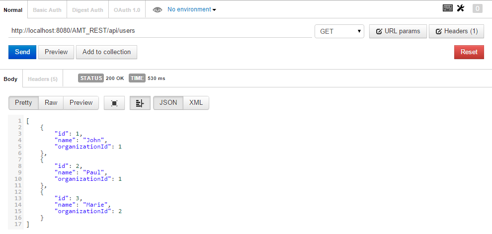
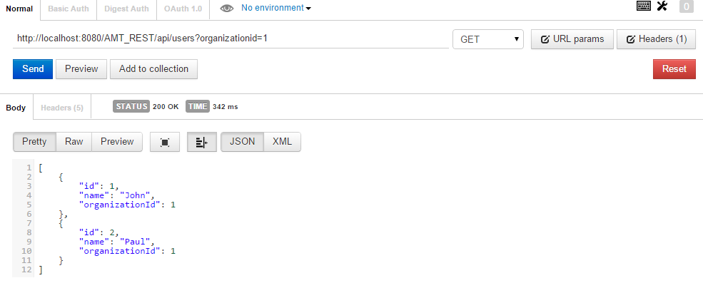
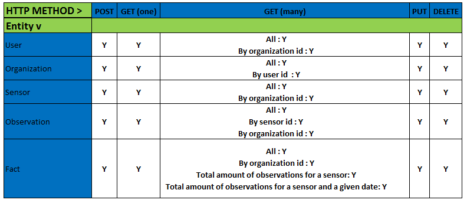
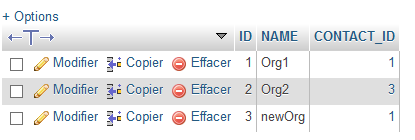

# Other infos not related to the functionning of the program #

In this part, we are going to list a few other things, like individual tests and dependencies used in the project.
## Dependencies ##

There are a few libs we used (use Maven to get them of course). This is an extract of the pom file.

	<dependencies>
		...
    	<dependency>
            <groupId>org.json</groupId>
            <artifactId>json</artifactId>
            <version>20141113</version>
        </dependency>
        <dependency>
            <groupId>com.sun.jersey</groupId>
            <artifactId>jersey-client</artifactId>
            <version>1.18.2</version>
            <scope>provided</scope>
        </dependency>
        <dependency>
            <groupId>joda-time</groupId>
            <artifactId>joda-time</artifactId>
            <version>2.6</version>
        </dependency>
		...
	<dependencies>
		

As you can see, 3 different dependencies, 

[org.json](http://mvnrepository.com/artifact/org.json/json/20141113) a simple JSON parser.

[Jersey Client](http://mvnrepository.com/artifact/com.sun.jersey/jersey-client) A Jersey client to test REST API. In the end, we decided to use a WebServlet instead, but this can still be useful in the future.

[Joda time](http://mvnrepository.com/artifact/joda-time/joda-time) for managing dates in Java.

That's all for this part, both the dependencies that we are actually using, are pretty straighforward and easy to understand.

## Tests ##

A WebServlet has been created to test the working infrastructure. To be able to use it and test the application, once it has been deployed on GlassFish (obviously), one only needs to type in the following URL:

    http://localhost:8080/AMT_REST/test

**/test** will be treated by the servlet, and it will create a few users, organizations, sensors and observations for us. With that, we can then see if the facts are correctly working.

We will now start doing some basic GET tests with [POSTMAN](https://chrome.google.com/webstore/detail/postman-rest-client/fdmmgilgnpjigdojojpjoooidkmcomcm). For example GET on all users :

    

As you can see, the way to use the API is to access : 

	http://localhost:8080/AMT_REST/api/

And then complete it with the values you want, for instance:

	http://localhost:8080/AMT_REST/api/users
	http://localhost:8080/AMT_REST/api/facts
	http://localhost:8080/AMT_REST/api/users?organizationid=1

For the last example, we are using query params, to be able to make our research more precise. In this case, the content we get is : 

Marie, which is part of Org2, is not shown because we want all users from the organization of id "1", which is Org1. Pretty easy, no? To access the full list of these query params and all the different HTTP methodes available, consult our official API documentation.

Now we will only put the results of our tests so far, using POSTMAN and PHPMyAdmin to verify that our system works.

So, we have been able to get all green on the functionnalities we tested. Let's now test all the GET methods we implemented, the other ones POST, PUT, etc are quite easy to test and they all work in the same fashion, so, we'll only do one of those to see how it works:

As you can see, the returned value is 3 (because we already created 2 organizations with the servlet), so it works.

Now let's get serious...

## GET Methods ##

> http://localhost:8080/AMT_REST/api/users

    [
	    {
	        "id": 1,
	        "name": "John",
	        "organizationId": 1
	    },
	    {
	        "id": 2,
	        "name": "Paul",
	        "organizationId": 1
	    },
	    {
	        "id": 3,
	        "name": "Marie",
	        "organizationId": 2
	    }
	]

> http://localhost:8080/AMT_REST/api/users?organizationid=1

    [
	    {
	        "id": 1,
	        "name": "John",
	        "organizationId": 1
	    },
	    {
	        "id": 2,
	        "name": "Paul",
	        "organizationId": 1
	    }
	]

> http://localhost:8080/AMT_REST/api/organizations

    [
	    {
	        "contactId": 1,
	        "id": 1,
	        "name": "Org1"
	    },
	    {
	        "contactId": 3,
	        "id": 2,
	        "name": "Org2"
	    },
	    {
	        "contactId": 1,
	        "id": 3,
	        "name": "newOrg"
	    }
	]

> http://localhost:8080/AMT_REST/api/organizations?userid=1

	[
	    {
	        "contactId": 1,
	        "id": 1,
	        "name": "Org1"
	    }
	]

> http://localhost:8080/AMT_REST/api/sensors

    [
	    {
	        "description": "None, really",
	        "id": 1,
	        "name": "sensor_org1_0",
	        "organizationId": 1,
	        "type": "THERMO",
	        "visibility": "All"
	    },
	    {
	        "description": "None, really",
	        "id": 2,
	        "name": "sensor_org1_1",
	        "organizationId": 1,
	        "type": "THERMO",
	        "visibility": "All"
	    },
	    {
	        "description": "None, really",
	        "id": 3,
	        "name": "sensor_org1_2",
	        "organizationId": 1,
	        "type": "THERMO",
	        "visibility": "All"
	    },
	    {
	        "description": "None, really",
	        "id": 4,
	        "name": "sensor_org1_3",
	        "organizationId": 1,
	        "type": "THERMO",
	        "visibility": "All"
	    },
		...

> http://localhost:8080/AMT_REST/api/sensors?organizationid=1

	[
	    {
	        "description": "None, really",
	        "id": 1,
	        "name": "sensor_org1_0",
	        "organizationId": 1,
	        "type": "THERMO",
	        "visibility": "All"
	    },
	    {
	        "description": "None, really",
	        "id": 2,
	        "name": "sensor_org1_1",
	        "organizationId": 1,
	        "type": "THERMO",
	        "visibility": "All"
	    },
	    {
	        "description": "None, really",
	        "id": 3,
	        "name": "sensor_org1_2",
	        "organizationId": 1,
	        "type": "THERMO",
	        "visibility": "All"
	    },
	    {
	        "description": "None, really",
	        "id": 4,
	        "name": "sensor_org1_3",
	        "organizationId": 1,
	        "type": "THERMO",
	        "visibility": "All"
	    },
	    {
	        "description": "None, really",
	        "id": 5,
	        "name": "sensor_org1_4",
	        "organizationId": 1,
	        "type": "THERMO",
	        "visibility": "All"
	    },
	    {
	        "description": "None, really",
	        "id": 6,
	        "name": "sensor_org1_5",
	        "organizationId": 1,
	        "type": "THERMO",
	        "visibility": "All"
	    },
	    {
	        "description": "None, really",
	        "id": 7,
	        "name": "sensor_org1_6",
	        "organizationId": 1,
	        "type": "THERMO",
	        "visibility": "All"
	    },
	    {
	        "description": "None, really",
	        "id": 8,
	        "name": "sensor_org1_7",
	        "organizationId": 1,
	        "type": "THERMO",
	        "visibility": "All"
	    },
	    {
	        "description": "None, really",
	        "id": 9,
	        "name": "sensor_org1_8",
	        "organizationId": 1,
	        "type": "THERMO",
	        "visibility": "All"
	    },
	    {
	        "description": "None, really",
	        "id": 10,
	        "name": "sensor_org1_9",
	        "organizationId": 1,
	        "type": "THERMO",
	        "visibility": "All"
	    }
	]

> http://localhost:8080/AMT_REST/api/observations

    [
	    {
	        "id": 1,
	        "sensorId": 1,
	        "timeS": "2014-12-13T18:00:06+01:00",
	        "valueObservation": 4.2076842236244065
	    },
	    {
	        "id": 2,
	        "sensorId": 2,
	        "timeS": "2014-12-13T18:00:06+01:00",
	        "valueObservation": 7.506136178921572
	    },
	    {
	        "id": 3,
	        "sensorId": 3,
	        "timeS": "2014-12-13T18:00:06+01:00",
	        "valueObservation": 5.841035453813964
	    },
	    {
	        "id": 4,
	        "sensorId": 4,
	        "timeS": "2014-12-13T18:00:06+01:00",
	        "valueObservation": 3.1001672217247167
	    },
	    {
	        "id": 5,
	        "sensorId": 5,
	        "timeS": "2014-12-13T18:00:06+01:00",
	        "valueObservation": 2.1797873932294998
	    },
	    {
	        "id": 6,
	        "sensorId": 6,
	        "timeS": "2014-12-13T18:00:06+01:00",
	        "valueObservation": 3.7641714925414083
	    },
		...

> http://localhost:8080/AMT_REST/api/observations?sensorid=1

	[
	    {
	        "id": 1,
	        "sensorId": 1,
	        "timeS": "2014-12-13T18:00:06+01:00",
	        "valueObservation": 4.2076842236244065
	    },
	    {
	        "id": 21,
	        "sensorId": 1,
	        "timeS": "2014-12-13T18:00:06+01:00",
	        "valueObservation": 2.4547415978470912
	    },
	    {
	        "id": 41,
	        "sensorId": 1,
	        "timeS": "2014-12-13T18:00:06+01:00",
	        "valueObservation": 9.732681344284494
	    },
	    {
	        "id": 61,
	        "sensorId": 1,
	        "timeS": "2014-12-13T18:00:07+01:00",
	        "valueObservation": 4.586141248944702
	    },
	    {
	        "id": 81,
	        "sensorId": 1,
	        "timeS": "2014-12-13T18:00:07+01:00",
	        "valueObservation": 4.373731168158363
	    },
		...
> http://localhost:8080/AMT_REST/api/observations?organizationid=2

	[
	    {
	        "id": 11,
	        "sensorId": 11,
	        "timeS": "2014-12-13T18:00:06+01:00",
	        "valueObservation": 5.499566086763732
	    },
	    {
	        "id": 31,
	        "sensorId": 11,
	        "timeS": "2014-12-13T18:00:06+01:00",
	        "valueObservation": 9.639600560004027
	    },
	    {
	        "id": 51,
	        "sensorId": 11,
	        "timeS": "2014-12-13T18:00:06+01:00",
	        "valueObservation": 8.36784144972404
	    },
	    {
	        "id": 71,
	        "sensorId": 11,
	        "timeS": "2014-12-13T18:00:07+01:00",
	        "valueObservation": 3.661668398316734
	    },
	    {
	        "id": 91,
	        "sensorId": 11,
	        "timeS": "2014-12-13T18:00:07+01:00",
	        "valueObservation": 3.0966806627626307
	    },
		...

> http://localhost:8080/AMT_REST/api/observations?organizationid=2&sensorid=11

	[
	    {
	        "id": 11,
	        "sensorId": 11,
	        "timeS": "2014-12-13T18:00:06+01:00",
	        "valueObservation": 5.499566086763732
	    },
	    {
	        "id": 31,
	        "sensorId": 11,
	        "timeS": "2014-12-13T18:00:06+01:00",
	        "valueObservation": 9.639600560004027
	    },
	    {
	        "id": 51,
	        "sensorId": 11,
	        "timeS": "2014-12-13T18:00:06+01:00",
	        "valueObservation": 8.36784144972404
	    },
	    {
	        "id": 71,
	        "sensorId": 11,
	        "timeS": "2014-12-13T18:00:07+01:00",
	        "valueObservation": 3.661668398316734
	    },
	    {
	        "id": 91,
	        "sensorId": 11,
	        "timeS": "2014-12-13T18:00:07+01:00",
	        "valueObservation": 3.0966806627626307
	    },
	    {
	        "id": 111,
	        "sensorId": 11,
	        "timeS": "2014-12-13T18:00:07+01:00",
	        "valueObservation": 4.974795743763689
	    },
		...

> http://localhost:8080/AMT_REST/api/facts

	[
	    {
	        "id": 1,
	        "information": "A test fact, just to see that facts are separated by date",
	        "organizationId": 2,
	        "sensorId": 20,
	        "type": "DATE_COUNTER",
	        "visibility": "ALL"
	    },
	    {
	        "id": 2,
	        "information": "51",
	        "organizationId": 1,
	        "sensorId": 1,
	        "type": "COUNTER",
	        "visibility": "ALL"
	    },
	    {
	        "id": 3,
	        "information": "{\"min\":0.0011727332647970545,\"avg\":1.9772292442778343,\"max\":9.953122573291932,\"counter\":51}",
	        "organizationId": 1,
	        "sensorId": 1,
	        "type": "DATE_COUNTER",
	        "visibility": "ALL"
	    },
	    {
	        "id": 4,
	        "information": "51",
	        "organizationId": 1,
	        "sensorId": 2,
	        "type": "COUNTER",
	        "visibility": "ALL"
	    },
		...

> http://localhost:8080/AMT_REST/api/facts?organizationid=1

	[
	    {
	        "id": 2,
	        "information": "51",
	        "organizationId": 1,
	        "sensorId": 1,
	        "type": "COUNTER",
	        "visibility": "ALL"
	    },
	    {
	        "id": 3,
	        "information": "{\"min\":0.0011727332647970545,\"avg\":1.9772292442778343,\"max\":9.953122573291932,\"counter\":51}",
	        "organizationId": 1,
	        "sensorId": 1,
	        "type": "DATE_COUNTER",
	        "visibility": "ALL"
	    },
	    {
	        "id": 4,
	        "information": "51",
	        "organizationId": 1,
	        "sensorId": 2,
	        "type": "COUNTER",
	        "visibility": "ALL"
	    },
	    {
	        "id": 5,
	        "information": "{\"min\":0.047014474424851294,\"avg\":5.6799662154228425,\"max\":9.749889573873155,\"counter\":51}",
	        "organizationId": 1,
	        "sensorId": 2,
	        "type": "DATE_COUNTER",
	        "visibility": "ALL"
	    },
		...

> http://localhost:8080/AMT_REST/api/facts?sensorid=1

Here we are getting the number of observations for Sensor1, which is 51 (Information field). This is Fact1.

	[
	    {
	        "id": 2,
	        "information": "51",
	        "organizationId": 1,
	        "sensorId": 1,
	        "type": "COUNTER",
	        "visibility": "ALL"
	    }
	]

> http://localhost:8080/AMT_REST/api/facts?sensorid=2&date=2014-12-13

This one is the fact counting the number of observations for a given sensor (Fact2) on a given date. Plus, it gives info as the min, avg and max values of observations (Stored in JSON form). Let's compare those with an other one

	[
	    {
	        "id": 5,
	        "information": "{\"min\":0.047014474424851294,\"avg\":5.6799662154228425,\"max\":9.749889573873155,\"counter\":51}",
	        "organizationId": 1,
	        "sensorId": 2,
	        "type": "DATE_COUNTER",
	        "visibility": "ALL"
	    }
	]

> http://localhost:8080/AMT_REST/api/facts?sensorid=6&date=2014-12-13

	[
	    {
	        "id": 13,
	        "information": "{\"min\":0.00947582941701608,\"avg\":5.7262561155133085,\"max\":9.530792379626892,\"counter\":51}",
	        "organizationId": 1,
	        "sensorId": 6,
	        "type": "DATE_COUNTER",
	        "visibility": "ALL"
	    }
	]

As you can see, not the same values. And this concludes our testing frenzy. To test the results of the facts, we use some easy mechanism. First, we make a know number of observations, each 20 sensor makes 51 observations for the current day (being 2014-12-13 here). So, obviously, both facts will tell us that 51 observations were made. Also, each Sensor has a type of values it sends. This value can be changed at some point, so changing this value on a sensor (and making new observations) will create a new fact (the one from the day, because this fact depends on :

- 	a sensor
- 	a date
- 	the type of the sensor

# Conclusion #

We only implemented some easy facts, easy GET methods and most-likely not in the "sexiest" way of doing so. But everything we wanted to do seems to work, after running our tests, so we are pretty happy with this :+1: