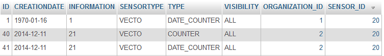
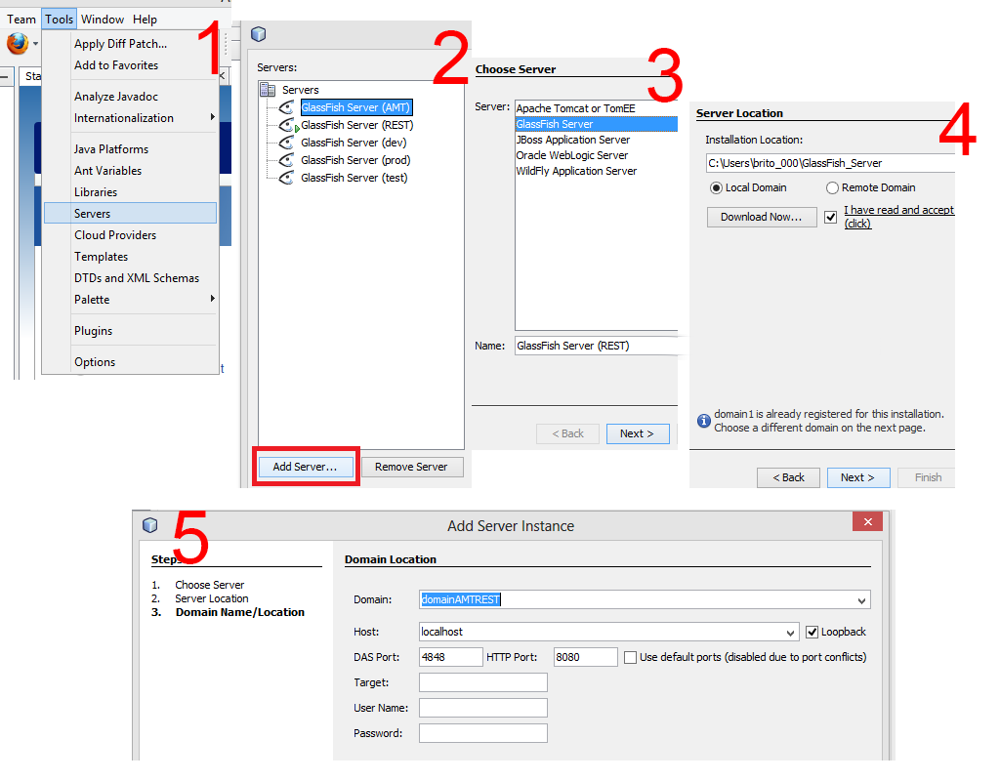
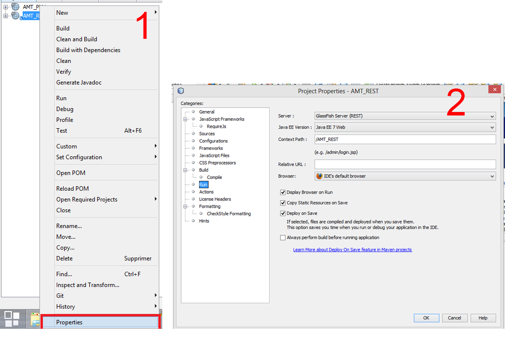

# AMT REST LAB #
## 2014 - Bignens Julien & B. Carvalho Bruno :uk:

#Warning#
This is the official guide to make our implementation of the AMT REST lab work. Follow this guide as strictly as possible, so it can work as it should.

## Introduction ##
The objective of this project is to emulate the behavior of a few sensors that create observations based on different values they collect (Internet Of Things style). We then want to use these observations to create "facts" that can be exploited by the users of this api. These facts can contain various informations. The next image is an example:

For the sensor number 20, we have 3 facts, the first one is a fact counting the number of observations that were taken by this sensor on the date of 1970-01-16 (soooo long ago). The second one is a counter, showing how many observations were taken so far by this sensor. The thirs and last one is the same as the first one, except, this time we want this info for 2014-12-11 (not so long ago). And we can see that the 2 lat columns have the same "information", which is normal, the only observations that were taken, were taken this same day. So basically, everyday, a new fact will be created, counting the number of observations for this particular day.

**Note:** in the DATE_COUNTER observations, there will be other infos (min,max and average value), but this was just to have an easy example.

## Step 1##
Enough babbling, let's start this. The first thing to do is to use the script dbScriptREST.sh to generate all the basic structure (glassfish domains, database, etc). You can find it in the [/scripts](https://github.com/bbcnt/AMT_REST/tree/master/scripts) path of this repo. Also, you'll need to edit a few values inside the script, so make sure you know:
 
1. The path to MySQL on your host
2. The path to Glassfish on your host
3. Where the mysql-connector.jar is (you can find it in the path [/jars](https://github.com/bbcnt/AMT_REST/tree/master/jarS) of this repo)

Once you know this, open the script and change the 3 variables on top, as in this example:

    #Your MySQL bin directory
	MYSQL_BIN_DIR=/cygdrive/c/wamp/bin/mysql/mysql5.6.12/bin

	#Your Glassfish bin directory
	GLASSFISH_BIN_DIR=/cygdrive/c/Users/brito_000/GlassFish_Server/glassfish/bin

	#Your path to the mysql-connector
	MYSQL_CONN_JAR=/cygdrive/c/Users/brito_000/GlassFish_Server/mysql-connector-java-5.1.33/mysql-connector-java-5.1.33/mysql-connector-java-5.1.33-bin.jar

You can now execute the script (on Windows, use [cygwin](https://www.cygwin.com/ "cygwin"), as an admin, of course).

    brito_000@BBC-Lenovo ~
	$ cd /cygdrive/c/Users/brito_000/

	brito_000@BBC-Lenovo /cygdrive/c/Users/brito_000
	 ./dbScriptREST.sh

If everything worked fine, you now have a new domain called domainAMTREST and a new database, called AMTDatabaseREST.

First part, OK :+1:

## Step 2 ##
So far, so good, the next step now is to clone the GitHub repo and make it work. Also, there are a few settings we have to change for Glassfish to work. There we go.

We are going to suppose that cloning a GitHub repo and opening it on NetBeans is common knowledge so we won't be spending a lot of time on this. From now on, we'll call this project on NetBeans, "**AMT_REST**". So, once it has been imported, the first thing we are going to do is to create a new GlassFish server that will be working on the newly created domain. To do so, just follow the following guide (do the shown step then press Next and Finish at the end):

We now have a fully operationnal GlassFish server working on our domain. The last thing we need to do is to link it with our project. To do so, Right-click on your project and then follow this guide:

Now we are finally ready to actually work with our application :clap: