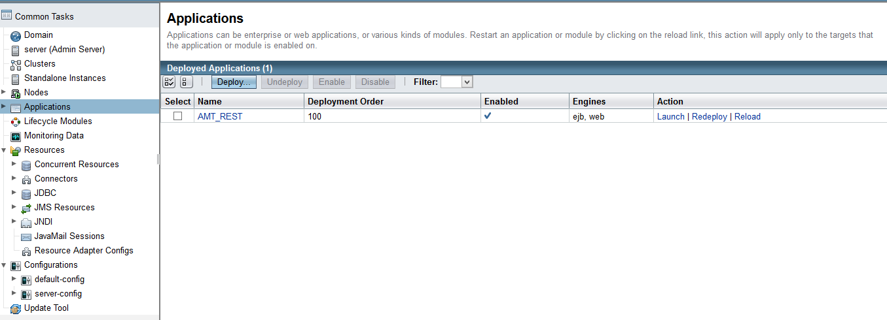
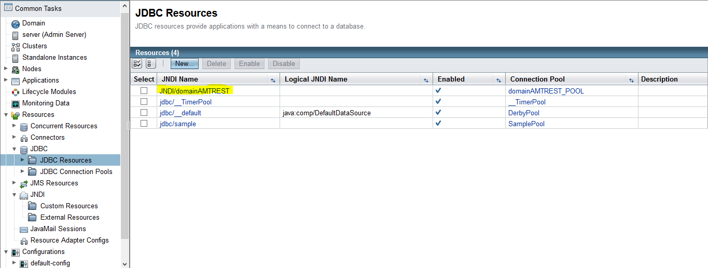
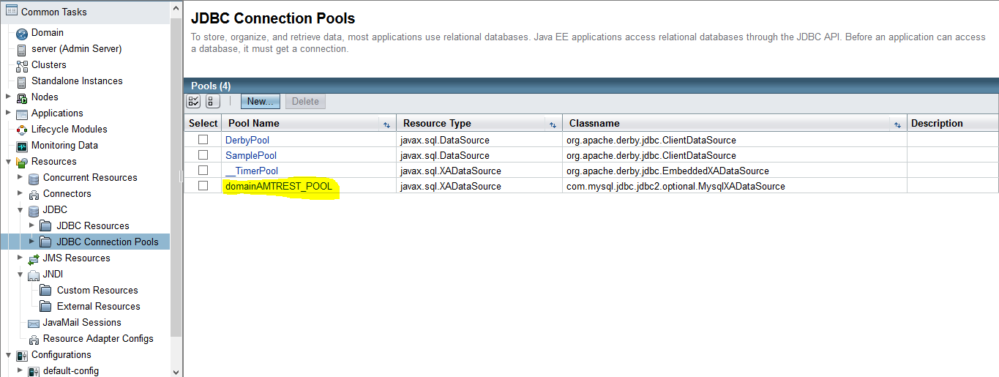
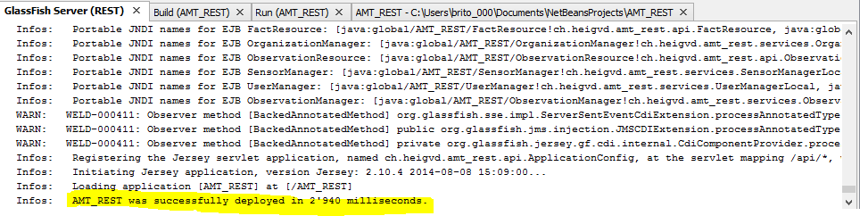

# AMT REST LAB #
## 2014 - Bignens Julien & B. Carvalho Bruno :uk:

#Due on the 15th of December, 2014#

#Warning#
This is the official guide to make our implementation of the AMT REST lab work. Follow this guide as strictly as possible, so it can work as it should. If you encounter any problems, check the Troubleshooting part at the end of this document. If you want come working examples, check the [API doc](https://bignensju.github.io/AMT_TEST) or [this page](https://github.com/bbcnt/AMT_REST/blob/master/Other_Infos.md).

## Introduction ##
The objective of this project is to emulate the behavior of a few sensors that create observations based on different values they collect (Internet Of Things style). We then want to use these observations to create "facts" that can be exploited by the users of this api. These facts can contain various informations. The next image is an example:

For the sensor number 20, we have 3 facts, the first one is a fact counting the number of observations that were taken by this sensor on the date of 1970-01-16 (soooo long ago). The second one is a counter, showing how many observations were taken so far by this sensor. The thirs and last one is the same as the first one, except, this time we want this info for 2014-12-11 (not so long ago). And we can see that the 2 lat columns have the same "information", which is normal, the only observations that were taken, were taken this same day. So basically, everyday, a new fact will be created, counting the number of observations for this particular day.

**Note:** in the DATE_COUNTER observations, there will be other infos (min,max and average value), but this was just to have an easy example.
## Step 0##

Before continuing, you need to have a few things installed:

- Clone this repo
- MySQL (with WAMP for example)
- NetBeans and GlassFish

if you have all of this, let's start.

## Step 1##
Enough babbling, let's start this. The first thing to do is to use the script dbScriptREST.sh to generate all the basic structure (glassfish domains, database, etc). You can find it in the [/scripts](https://github.com/bbcnt/AMT_REST/tree/master/scripts) path of this repo. Also, you'll need to edit a few values inside the script, so make sure you know:
 
1. The path to MySQL on your host
2. The path to Glassfish on your host
3. Where the mysql-connector.jar is (you can find it in the path [/jars](https://github.com/bbcnt/AMT_REST/tree/master/jarS) of this repo)

Once you know this, open the script and change the 3 variables on top, as in this example:

    #Your MySQL bin directory
	MYSQL_BIN_DIR=/cygdrive/c/wamp/bin/mysql/mysql5.6.12/bin

	#Your Glassfish bin directory
	GLASSFISH_BIN_DIR=/cygdrive/c/Users/brito_000/GlassFish_Server/glassfish/bin

	#Your path to the mysql-connector
	MYSQL_CONN_JAR=/cygdrive/c/Users/brito_000/GlassFish_Server/mysql-connector-java-5.1.33/mysql-connector-java-5.1.33/mysql-connector-java-5.1.33-bin.jar

You can now execute the script (on Windows, use [cygwin](https://www.cygwin.com/ "cygwin"), as an admin, of course).

    brito_000@BBC-Lenovo ~
	$ cd /cygdrive/c/Users/brito_000/

	brito_000@BBC-Lenovo /cygdrive/c/Users/brito_000
	 ./dbScriptREST.sh

If everything worked fine, you now have a new domain called domainAMTREST and a new database, called AMTDatabaseREST.

First part, OK :+1:

## Step 2 ##
So far, so good, the next step now is to clone the GitHub repo and make it work. Also, there are a few settings we have to change for Glassfish to work. There we go.

We are going to suppose that cloning a GitHub repo and opening it on NetBeans is common knowledge so we won't be spending a lot of time on this. From now on, we'll call this project on NetBeans, "**AMT_REST**". So, once it has been imported, the first thing we are going to do is to create a new GlassFish server that will be working on the newly created domain. To do so, just follow the following guide (do the shown step then press Next and Finish at the end):

**Note:** Please note that in Step 4, you may need to enter a different way to get GlassFish (remote or other directory obviously. Chance is, it is often filled for you).

We now have a fully operationnal GlassFish server working on our domain. The last thing we need to do is to link it with our project. To do so, Right-click on your project and then follow this guide:

Now we are finally ready to actually work with our application :clap:

## Step 3 ##

We can now work with our application. So first, what does it do? Let's take a look at our model:

We have an infrastructure where we have sensors pushing observations. These observations can be pretty much anything that returns a numerical value (heat, wind, lighting, etc). To be able to get personnal data, we also implement a notion of organizations and users. Basically, a user is part of an organization, an organization has many users and one of them is the manager. In the future, we would like to offer an API for managing users and permissions, but so far, this aspect is not our primary concern. 

Now, we have observations appartaining to organizations, what can we do more? Get facts out of these observations of course. Facts are information created from the observations, that contain average values, counts the amout of observations, etc etc. So it's pretty interesting for the people owning sensors to get those facts. This is the main objective of this API.

Talking about API, we may have only one that does everything, in the future the idea would be to have something like : 

- An API for sensors, only pushing information
- An API for managing users, where organizations and users can be managed
- A developper API, , to get the facts and observations and work with them

## Facts ##

At this moment, we are offering two types of Facts:

- A fact counting the number of observations for a sensor, we call it **Fact1**
- A fact counting the number of observations for a sensor and for a given date, we call it **Fact2**

This information is represented by a String value called "Type" in the Fact class.

Now, let's see how they work, pretty much.

First of all, Facts work in a fashion that allows them to be "generic". We keep all the important info (organization, sensor, type of the sensor) and we have a field where any kind of info can be stored. May it be numerical values, text, JSON data, it's your call. So in our database, we have all the facts in the same table.

Now, an other important thing is, how is a Fact defined? Well, let's start with **Fact1**. A Fact1 is linked to a sensor and the type of the sensor. So, it sensor1 decides for any reason to stop getting thermal info and get info about the wind instead, a new Fact will be created. So we'll have two facts, the one that was counting the observations prior the change of type, and the one after. To understand this, you can check [this link](https://github.com/bbcnt/AMT_REST/blob/master/Other_Infos.md) where we explain at the end how this works.

For a **Fact2** now, the mechanism is the same, only two majors differences:

- we store more information 
- we store the creation date

Why these differences? Well, instead of just counting the number of observations, we now are able to get the min/max/avg values as well. Pretty useful no? Also, by using the date as a decisive variable, users (you) can now query the REST api with a given date (yyyy-MM-d) and get the observations for a specific sensor on a specific date.

Of course, all this information can be found in the RAML documentation, but also [here](https://github.com/bbcnt/AMT_REST/blob/master/Other_Infos.md), a few examples are available.

So to resume all this : 

- a fact is defined by a sensor and its type
- some facts make use of their creation date
- facts are always stored in the same table

# List of commands #

All this can be found in the API doc, but here is a little heads up on how it works.

Once you get your URL, such as : 

 	http://localhost:8080/AMT_REST/api/

you then have the choice to do some operations:

To get every {info}

	GET .../api/{info}/

To get only one {info}

	GET .../api/{info}/{id}

To post a new info

	POST .../api/{info}
	And you payload in JSON format

To update an existing info

	PUT .../api/{info}
	And the payload in JSON (also include the id of your object here)

To delete an existing {info}

	DELETE .../api/{info}/{id}

And you can replace {info} by 

- organizations
- users
- sensors
- observations
- facts

And {id} by 

- a numerical value (id of the object)

Example:

	GET .../api/organizations/2

Will get you the organization with id number 2.

# Conclusion #

This is the end of this little introduction. Its objective was to explain (lightly) how the application works and how to get it working. What now? You can now check both these links: 

- [RAML documentation](http://bignensju.github.io/AMT_TEST/)
- [Testing documentation](https://github.com/bbcnt/AMT_REST/blob/master/Other_Infos.md)

First link is the RAML documentation where you can find all the available REST commands of our project.

The second link is a documentation where we test all the GET methods and clarify a few things about Fact1 and Fact2, mostly, why we decided to implement them in this way. Looking at the comments in the source code can also prove useful.

# Troubleshooting #

This section is about fixing some of the problems you may have:

> I don't have test values.

Did you run [http://localhost:8080/AMT_REST/test](http://localhost:8080/AMT_REST/test) ?

> My database called *amtdatabaserest* doesn't exist on MySQL.

Did you run the script [dbScriptREST.sh](https://github.com/bbcnt/AMT_REST/blob/master/scripts/dbScriptREST.sh)? If yes, check the result for eventual errors. Also, creating it manually on PHPMyAmin may work, it the creation of the DB is the only problem you have (assuming all the other operations worked).

> I don't know how to test the API

You can use both a navigator or an API tester, like [POSTMAN](https://chrome.google.com/webstore/detail/postman-rest-client/fdmmgilgnpjigdojojpjoooidkmcomcm). The way to interact is the REST way, using the URL.

> I detected some problems in the code, what can I do?

Well, why not [issue an issue](https://github.com/bbcnt/AMT_REST/issues)? So we can check the rêrror and try to fix it.

> I want a particular GET method and it doens't work, can I implement it myself?

Well, yes, but you shouldn't. Again, using the [issue](https://github.com/bbcnt/AMT_REST/issues) option would be the way to go.

> My database is empty 

Well, the content of the database (except for the tables) only survives the execution of the application (drop and create clause). So it's normal, to get values again, run the WebServletTest with /test

> Nothing is working, what the hell? 

In this case, let's try a few things. First, login into the GlassFish admin console :

	http://localhost:4848

Check under the Application tab that your application is up and kicking:

Then check that the existing JDBC resource is there too:

Lastly, check that the JDBC pool was also created:

It everything is in place, and that you get this kind of message from NetBeans : 

Then everything is working just fine, are you sure you were not mistaken? 